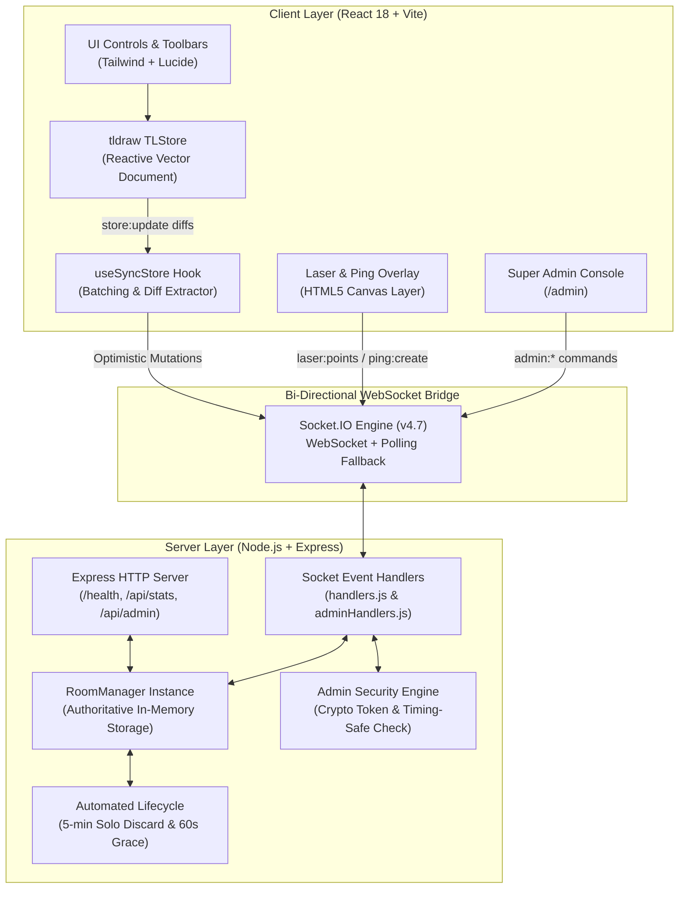

<div align="center">

# 🎨 CanvasX

### Production-Ready, Real-Time Collaborative Vector Whiteboard System

[](LICENSE)
[](https://nodejs.org/)
[](https://react.dev/)
[](https://vitejs.dev/)
[](https://tldraw.dev/)
[](https://socket.io/)
[](https://tailwindcss.com/)
[](https://www.docker.com/)
[-success?style=for-the-badge&logo=node.js&logoColor=white)](#-testing--quality-assurance)

<p align="center">
  <b>CanvasX</b> is an ultra-fast, 100% self-hosted, real-time collaborative whiteboard platform built with <b>React 18</b>, <b>tldraw v2</b>, and <b>Socket.IO</b>. Draw together live on an infinite vector canvas, guide meetings with synced laser trails and radar pings, manage rooms with host governance, and monitor the entire system through an exclusive real-time Super Admin console.
</p>

[Quick Start](#-quick-start) • [Features](#-features) • [Architecture](#-architecture) • [Super Admin Console](#-super-admin-console) • [Shortcuts](#-keyboard-shortcuts) • [Protocol Reference](#-real-time-protocol-reference) • [Docker Deployment](#-docker--production-deployment)

---

</div>

## 📑 Table of Contents

- [Overview & Motivation](#-overview--motivation)
- [Key Features](#-features)
  - [Real-Time Collaboration](#1-real-time-collaboration)
  - [Live Presentation & Attention Tools](#2-live-presentation--attention-tools)
  - [Comprehensive Vector Drawing Engine](#3-comprehensive-vector-drawing-engine)
  - [Room Governance & Lifecycle Automation](#4-room-governance--lifecycle-automation)
  - [Super Admin Control Console](#5-super-admin-control-console)
- [Architecture & Data Flow](#-architecture--data-flow)
- [Tech Stack](#-tech-stack)
- [Keyboard Shortcuts](#-keyboard-shortcuts)
- [Quick Start](#-quick-start)
  - [Prerequisites](#prerequisites)
  - [Local Development Setup](#local-development-setup)
  - [Using Make](#using-make)
- [Docker & Production Deployment](#-docker--production-deployment)
  - [Docker Compose](#docker-compose-recommended)
  - [Render Deployment](#render-cloud-deployment)
- [Configuration & Environment Variables](#-configuration--environment-variables)
- [Real-Time Protocol Reference](#-real-time-protocol-reference)
  - [Room Lifecycle Events](#room-lifecycle-events)
  - [Document Sync (tldraw Store)](#document-synchronization-tldraw-multiplayer-store)
  - [Ephemeral Presence & Presentation](#ephemeral-presence--presentation)
  - [Super Admin Real-Time Events](#super-admin-socket-events)
  - [REST API Endpoints](#rest-api-endpoints)
- [Testing & Quality Assurance](#-testing--quality-assurance)
- [Project Directory Structure](#-project-directory-structure)
- [Contributing](#-contributing)
- [License & Author](#-license--author)

---

## 💡 Overview & Motivation

Most enterprise whiteboard tools (such as Miro, FigJam, or proprietary SaaS solutions) impose heavy per-seat monthly subscription tiers, track user telemetry, enforce artificial canvas boundaries, and transmit sensitive engineering diagrams to third-party cloud infrastructure.

**CanvasX** delivers a modern, privacy-first, zero-subscription alternative:
- **100% Data Sovereignty**: All whiteboard state resides transiently in your own Node.js server memory.
- **Zero Cloud Costs**: Does not rely on paid external CRDT engines or tldraw Cloud SaaS tokens.
- **Lightweight Runtime**: Fast hardware-accelerated SVG/Canvas rendering with optimistic client updates.
- **Automated Memory Hygiene**: Automatically cleans up abandoned rooms to prevent memory bloat.
- **Enterprise Governance**: Built-in room host moderation plus a dedicated Super Admin monitoring suite.

---

## ✨ Features

### 1. Real-Time Collaboration
- **Sub-Millisecond Document Sync**: Instant bidirectional document replication powered by tldraw's reactive store and Socket.IO diff streaming.
- **1-Click Invite Links & Room Codes**: Easily spawn human-readable room codes (e.g. `ART-4821`, `SPARK-6744`) or share direct URLs (`/?room=ART-4821`) that auto-fill upon opening.
- **Live Multi-User Cursors & Roster**: Live collaborator cursor coordinates rendered directly on the infinite canvas with distinct assigned colors and display names.
- **Optimistic Reconciliation**: Local drawing strokes render immediately at 60+ FPS while reconciling remote mutations seamlessly without visual jitter.

### 2. Live Presentation & Attention Tools
- 🔴 **Synced Vector Laser Pointer (`Hotkey: L` or Toolbar)**: Draw luminous glowing trails across the canvas that automatically fade out with smooth quadratic bezier curves after 1.5 seconds. Guides focus during sprint planning, retros, or design critiques without cluttering the board.
- 📡 **Radar Attention Ping (`Alt + Click` or Toolbar)**: Dispatch expanding sonar ripple animations accompanied by a synthesized audio chime and an author tag to instantly snap all collaborators' view to your focal point.

### 3. Comprehensive Vector Drawing Engine
- **20 Geometric Shapes**: Full toolbar access to:
  - *Polygons & Standard Shapes*: Rectangle / Box, Ellipse / Circle, Triangle, Diamond, Pentagon, Hexagon, Octagon, Trapezoid, Rhombus, Rhombus-2, Oval, Star.
  - *Expressive & Diagramming*: Cloud, Heart, X-Box, Check-Box.
  - *Directional Vectors*: Arrow-Left, Arrow-Up, Arrow-Down, Arrow-Right.
- **Freeform Creative Tools**: Freehand pen (`Draw`), semi-transparent highlighter, smart connector arrows, rich sticky notes (`Note`), editable text frames, and grouping bounding boxes.
- **Custom Style Inspector & 13 Swatches**:
  - 13 distinct color swatches (including pure white with high-contrast outlines and rich secondary tones).
  - 4 Fill Styles: *None*, *Semi*, *Solid*, *Pattern*.
  - 4 Dash Styles: *Draw*, *Dashed*, *Dotted*, *Solid*.
  - 4 Size Options: *S*, *M*, *L*, *XL*.
  - Dynamic responsive positioning via `--app-header-bottom` ensuring header controls never obstruct the style dialog.
- **Infinite Canvas & Vector Export**: Infinite pan and pinch-to-zoom with single-click export to PNG, SVG, or raw JSON.

### 4. Room Governance & Lifecycle Automation
- 👑 **Host Role & Auto-Succession**: The room creator is automatically designated as the room **Host** (`Crown` badge). If the host departs, privileges smoothly promote to the next senior participant.
- 👥 **Collaborator Roster Popover**: Top-bar popover displaying active participants, roles, assigned cursor colors, and moderation controls.
- 🚫 **Participant Kick Moderation (`room:kick`)**: Room hosts can remove disruptive participants with an optional reason. Kicked users are permanently blocked from rejoining the room (`kickedIds` blocklist) and routed back to the lobby.
- 🗑️ **Host Room Discard (`room:discard`)**: Hosts can close the whiteboard session on demand with confirmation dialogs, immediately clearing server memory.
- ⏳ **5-Minute Single-User Discard Timer**: To conserve server resources, rooms with only one participant run a 5-minute discard countdown banner. The moment a second collaborator joins, the timer automatically clears.
- 🛡️ **60-Second Disconnect Grace Period**: If all participants reload (`F5`/`Cmd+R`) or experience network blips, the backend holds the whiteboard in memory for 60 seconds before cleanup.

---

### 5. 🛡️ Super Admin Control Console

Access the exclusive Super Admin Console at **`/admin`** (or via **`/?admin=true`** and the security shield button on the homepage). Protected by timing-safe master password verification and cryptographically signed session tokens.

```
┌────────────────────────────────────────────────────────────────────────┐
│                        CANVASX SUPER ADMIN CONSOLE                     │
├────────────────────┬────────────────────┬──────────────────────────────┤
│  ⚡ Active Rooms   │  👥 Active Users   │  🎨 Total Shapes Drawn       │
│        14          │        42          │             3,820            │
├────────────────────┴────────────────────┴──────────────────────────────┤
│  💾 Heap Memory: 42.1 MB / RSS: 78.4 MB   ⏱️ Server Uptime: 4d 18h     │
├────────────────────────────────────────────────────────────────────────┤
│  [ Active Rooms ] [ Global Users ] [ Real-Time Feed ] [ Broadcast ]    │
│  ───────────────────────────────────────────────────────────────────  │
│  • Live Room Inspector: Inspect shapes, record counts & schema status  │
│  • Remote Canvas Wipe: Instantly purge drawings for moderation         │
│  • Force Discard & Kick: Terminate any rogue session or participant    │
│  • Global Announcements: Broadcast info / warning / alert banners     │
│  • Real-Time Activity Feed: Live event stream of joins, draws & kicks  │
└────────────────────────────────────────────────────────────────────────┘
```

- **Live System Telemetry**: Real-time gauges for active rooms, connected users, total historical rooms, total shapes drawn, uptime, RSS and heap memory consumption.
- **Live Room Inspector**: Inspect any active room's memory state, participant roster, shape breakdown, and view 50-shape structural previews.
- **Moderation Actions**: Remote canvas wipe (`admin:clear_canvas`), force kick user from any room (`admin:force_kick_user`), and force room termination (`admin:force_discard_room`).
- **Global & Targeted Announcements**: Broadcast instant banner alerts with 3 urgency tiers (`info`, `warning`, `alert`) to all connected users or targeted specific room codes.
- **Audit Activity Feed**: Live streaming log recording all room creations, joins, leaves, kicks, discards, and administrative operations.

---

## 🏛️ Architecture & Data Flow



### The "DIY Multiplayer" Sync Mechanism
1. **Initial Seeding**: The first user in a room becomes the initializer and uploads the document schema snapshot (`store:init`).
2. **Hydration**: Late joiners receive the cached server snapshot and hydrate their local canvas via `loadStoreSnapshot`.
3. **Incremental Diffing**: Subsequent strokes produce scoped document diffs (`{ added, updated, removed }`), sent over Socket.IO (`store:update`).
4. **Merge & Reconciliation**: Peers apply remote diffs via `store.mergeRemoteChanges()`, maintaining fluid vector performance without race conditions.

---

## 💻 Tech Stack

| Domain | Technology | Description |
|:---|:---|:---|
| **Frontend Framework** | React 18 | Declarative component UI and state management |
| **Canvas Engine** | tldraw v2 (`v2.4.6`) | Hardware-accelerated infinite vector canvas |
| **Build Tool** | Vite 5 | Fast Hot Module Replacement and production bundling |
| **Styling** | Tailwind CSS 3 | Modern utility-first CSS with custom themes & glassmorphism |
| **Icons** | Lucide React | Clean, scalable vector iconography |
| **Backend Runtime** | Node.js (ES Modules) | Lightweight asynchronous runtime |
| **Web Server** | Express 4 | REST routing, health checks, and middleware |
| **Real-time Protocol** | Socket.IO 4.7 | WebSocket server with automatic polling fallback |
| **Security & Auth** | Node.js Crypto | Timing-safe buffer comparisons & 256-bit admin session tokens |
| **DevOps & Containers**| Docker & Docker Compose | Multi-stage production containerization with Nginx |
| **Reverse Proxy** | Nginx Alpine | High-efficiency static SPA file server and proxy |

---

## ⌨️ Keyboard Shortcuts

| Shortcut | Tool / Action | Description |
|:---|:---|:---|
| **`L`** | 🔴 Laser Pointer | Toggle synced fading laser trail tool |
| **`Alt + Click`** | 📡 Radar Ping | Trigger sonar focus ripple and chime at coordinates |
| **`V`** / **`1`** | Select / Transform | Select, resize, rotate, and group shapes |
| **`H`** / **`Space + Drag`**| Hand / Pan | Pan smoothly across the infinite canvas |
| **`D`** / **`B`** | Draw Tool | Freehand vector pencil & pen |
| **`E`** | Eraser Tool | Erase drawn strokes and shapes |
| **`R`** | Rectangle | Create rectangular boxes |
| **`O`** | Ellipse | Create circles and ovals |
| **`T`** | Text | Insert rich typography block |
| **`N`** | Sticky Note | Create colored collaboration sticky notes |
| **`A`** | Arrow | Connector arrows with smart snapping |
| **`F`** | Frame | Group drawings into exportable artboards |
| **`Ctrl / Cmd + Z`** | Undo | Revert previous action |
| **`Ctrl / Cmd + Shift + Z`**| Redo | Reapply previously reverted action |
| **`Ctrl / Cmd + A`** | Select All | Select all objects on the canvas |
| **`Delete` / `Backspace`**| Delete | Remove selected objects |

---

## 🚀 Quick Start

### Prerequisites
- **Node.js**: `v18.0.0` or higher (`v20+` LTS recommended)
- **npm**: `v9.0.0` or higher (or `pnpm` / `yarn`)
- **Docker** *(Optional, for containerized run)*: Docker Desktop / Docker Engine 20+

### Local Development Setup

1. **Clone the repository:**
   ```bash
   git clone https://github.com/pithva007/CanvasX.git
   cd CanvasX
   ```

2. **Install dependencies:**
   ```bash
   # Install server and client packages
   cd server && npm install
   cd ../client && npm install
   cd ..
   ```

3. **Configure Environment Variables:**
   ```bash
   # Server environment setup
   cp server/.env.example server/.env

   # (Optional) Customize ADMIN_SECRET_KEY in server/.env
   ```

4. **Launch Development Servers:**

   Open two terminal windows:

   **Terminal 1 (Backend - Port 3001):**
   ```bash
   cd server
   npm run dev
   ```

   **Terminal 2 (Frontend - Port 5173):**
   ```bash
   cd client
   npm run dev
   ```

5. **Open in Browser:**
   - **Frontend App**: `http://localhost:5173`
   - **Super Admin Console**: `http://localhost:5173/admin` (or click the shield icon on homepage)
   - **Backend Health Check**: `http://localhost:3001/health`

---

### Using Make

CanvasX includes a `Makefile` with common developer commands:

```bash
make install       # Install dependencies across client & server
make dev           # Displays instructions to start development servers
make dev-server    # Starts backend in watch mode on port 3001
make dev-client    # Starts frontend Vite dev server on port 5173
make build         # Compiles production-ready client bundle
make docker-up     # Builds and starts full stack via Docker Compose
make docker-down   # Shuts down Docker Compose containers
make clean         # Removes node_modules and build directories
make help          # Displays all available make commands
```

---

## 🐳 Docker & Production Deployment

### Docker Compose (Recommended)

Run the production multi-container stack (Nginx SPA Frontend + Node.js Backend) with a single command:

```bash
docker compose up --build -d
```

- **Frontend Application**: `http://localhost:80`
- **Backend API & WebSockets**: `http://localhost:3001`
- **Health Verification**: `http://localhost:3001/health`

To stop the containers:
```bash
docker compose down
```

---

### Render Cloud Deployment

CanvasX includes a native **`render.yaml`** configuration for 1-click deployment on Render:

1. Fork or push this repository to GitHub.
2. In the Render Dashboard, click **New +** > **Blueprint**.
3. Connect your repository. Render will automatically provision:
   - **`canvasx-backend`**: Node web service (`server/`) with environment variables.
   - **`canvasx-frontend`**: Static site (`client/`) configured with SPA rewrite routing.
4. Set `CLIENT_URL` on the backend to match your frontend domain for CORS authorization.

---

## ⚙️ Configuration & Environment Variables

### Backend Configuration (`server/.env`)

| Variable | Default Value | Description |
|:---|:---|:---|
| `PORT` | `3001` | Port number the HTTP & Socket.IO server listens on |
| `NODE_ENV` | `development` | Environment mode (`development` \| `production`) |
| `CLIENT_URL` | `http://localhost:5173` | Allowed frontend origin for CORS policies |
| `MAX_USERS_PER_ROOM` | `50` | Maximum simultaneous collaborators allowed per room |
| `EMPTY_ROOM_GRACE_PERIOD_MS`| `60000` (60s) | Grace period before purging empty room from memory |
| `ADMIN_SECRET_KEY` | `CanvasX@Admin2026!` | Master password required to access the Super Admin Panel |

### Frontend Configuration (`client/.env`)

| Variable | Default Value | Description |
|:---|:---|:---|
| `VITE_API_URL` | `http://localhost:3001` | HTTP API base URL for health and admin REST requests |
| `VITE_SOCKET_URL` | `http://localhost:3001` | Socket.IO server connection endpoint |

---

## 🔌 Real-Time Protocol Reference

### Room Lifecycle Events

| Event | Direction | Payload | Description |
|:---|:---:|:---|:---|
| `room:create` | Client → Server | `{ name }` | Requests generation of a new room session. |
| `room:join` | Client → Server | `{ roomCode, name }` | Joins existing room; retrieves current canvas state. |
| `room:leave` | Client → Server | _none_ | Gracefully departs from active room. |
| `room:kick` | Client → Server | `{ roomCode, userId, reason }` | Host removes a participant from the room. |
| `room:discard` | Client → Server | `{ roomCode, reason }` | Host closes and terminates the entire room session. |
| `room:user-joined`| Server → Client | `{ user, users, adminId }` | Emitted to room when a peer connects. |
| `room:user-left` | Server → Client | `{ userId, users, adminId }`| Emitted to room when a peer disconnects or leaves. |
| `room:timer-started`| Server → Client | `{ singleUserDiscardAt }`| Starts the 5-minute single-user discard countdown. |
| `room:timer-cancelled`| Server → Client| _none_ | Signals 2+ users present; resets discard timer. |
| `room:discarded` | Server → Client | `{ message, roomCode }` | Broadcast to all users when room is closed/discarded. |
| `room:kicked` | Server → Client | `{ message, roomCode }` | Direct alert sent to user when kicked by host/admin. |

### Document Synchronization (tldraw Multiplayer Store)

| Event | Direction | Payload | Description |
|:---|:---:|:---|:---|
| `store:init` | Client → Server | `{ roomId, snapshot }` | Seeding client registers authoritative canvas document. |
| `store:seeded` | Server → Client | _none_ | Signals to waiting peers that document is ready. |
| `store:request-snapshot`| Client → Server| `{ roomId }` | Requests complete canvas document state. |
| `store:update` | Bi-directional | `{ roomId, updates }` | Batched document diffs (`{ added, updated, removed }`). |

### Ephemeral Presence & Presentation

| Event | Direction | Payload | Description |
|:---|:---:|:---|:---|
| `presence:update` | Bi-directional | `{ roomId, presence }` | Ephemeral cursor coordinates and display name. |
| `presence:leave` | Bi-directional | `{ roomId, userId }` | Cleans up cursor upon user disconnection. |
| `laser:points` | Bi-directional | `{ roomId, userId, points, color }` | Coordinates for synced fading laser pointer trails. |
| `ping:create` | Bi-directional | `{ roomId, point, color, userName }`| Coordinates and trigger for radar attention ripple. |

---

### Super Admin Socket Events

| Event | Direction | Payload | Description |
|:---|:---:|:---|:---|
| `admin:auth` | Client → Server | `{ password }` | Authenticate admin and receive cryptographic session token. |
| `admin:verify_token` | Client → Server | `{ token }` | Restore active admin session across page reloads. |
| `admin:logout` | Client → Server | _none_ | Revoke admin session token and leave admin channel. |
| `admin:get_overview` | Client → Server | _none_ | Retrieve comprehensive metrics, rooms, users, and audit logs. |
| `admin:inspect_room` | Client → Server | `{ roomCode }` | Inspect room memory state, shape stats, and preview records. |
| `admin:clear_canvas` | Client → Server | `{ roomCode }` | Moderation wipe of all drawings in a specific room. |
| `admin:force_discard_room`| Client → Server| `{ roomCode, reason }` | Super Admin forcibly terminates any room. |
| `admin:force_kick_user`| Client → Server | `{ roomCode, userId, reason }`| Super Admin forcibly kicks any user across any room. |
| `admin:broadcast_announcement`| Client → Server| `{ message, targetRoomCode, level }` | Broadcast system announcement to all or specific rooms. |
| `system:announcement` | Server → Client | `{ id, message, level, sender, timestamp }` | Live banner alert rendered across client screens. |
| `admin:rooms_update` | Server → Client | `{ rooms, stats }` | Real-time push of room states to open admin dashboards. |
| `admin:activity` | Server → Client | `{ type, roomCode, details, timestamp }` | Live streaming audit event pushed to admin dashboards. |

---

### REST API Endpoints

| Method | Endpoint | Auth Required | Description |
|:---|:---|:---:|:---|
| `GET` | `/health` | No | Basic server health check and active session counts |
| `GET` | `/api/stats` | No | Public room and user counts |
| `POST` | `/api/admin/login` | Password | Super admin login returning session token |
| `GET` | `/api/admin/overview` | Admin Token | Complete server stats, rooms list, and activity log |
| `POST` | `/api/admin/broadcast` | Admin Token | Dispatch global or room-targeted system announcement |
| `POST` | `/api/admin/rooms/:roomCode/discard` | Admin Token | Force discard room via REST endpoint |
| `POST` | `/api/admin/users/:userId/kick` | Admin Token | Force kick user via REST endpoint |

---

## 🧪 Testing & Quality Assurance

CanvasX includes automated unit and integration tests powered by Node.js's native test runner (`node:test`). Tests cover RoomManager lifecycle methods, host assignments, kick moderation, rejoinder blocks, and full multi-client Socket.IO integration flows.

Run the test suite:

```bash
cd server
npm test
```

**Test Execution Results:**
```bash
✔ Room admin assignment and transfer (0.54ms)
✔ RoomManager handles room creation, admin tracking, and discardRoom (0.95ms)
✔ RoomManager handles kickUserFromRoom and prevents kicked users from rejoining (0.46ms)
✔ Socket.IO room admin and discard integration flow (89.34ms)
✔ Socket.IO admin transfer when admin leaves and successor discards room (13.62ms)
✔ Socket.IO room kick integration flow (145.68ms)
✔ Admin Auth: password verification and token lifecycle (0.63ms)
✔ RoomManager: activity logs and global stats tracking (1.99ms)
✔ Socket.IO: Super Admin authentication, monitoring, and controls (38.65ms)

ℹ tests 9
ℹ suites 0
ℹ pass 9
ℹ fail 0
```

Frontend bundle validation:
```bash
cd client
npm run build
# Compiles cleanly via Vite with zero bundling errors
```

---

## 📁 Project Directory Structure

```
CanvasX/
├── client/                                 # React 18 + Vite Frontend Application
│   ├── public/                             # Static public assets
│   │   └── _redirects                      # Render SPA redirect configuration
│   ├── src/
│   │   ├── components/                     # Reusable UI Components
│   │   │   ├── CustomStylePanel.jsx        # 13 color swatches & stroke style panel
│   │   │   ├── ErrorBoundary.jsx           # Global React error boundary fallback
│   │   │   ├── LaserAndPingOverlay.jsx     # Canvas overlay for laser trails & sonar pings
│   │   │   ├── SystemAnnouncementBanner.jsx# Dismissible live admin announcement banner
│   │   │   └── Toast.jsx                   # Ephemeral toast notification system
│   │   ├── context/                        # React Context Providers
│   │   │   ├── SocketContext.jsx           # Socket.IO connection manager & reconnect logic
│   │   │   └── WhiteboardContext.jsx       # Room state, user rosters & countdown timers
│   │   ├── hooks/                          # Custom React Hooks
│   │   │   ├── useSocketEvents.js          # Room events, roster, kick & discard listeners
│   │   │   ├── useSyncStore.js             # tldraw store sync engine (diffs, snapshots)
│   │   │   └── useToast.js                 # Toast state and emitter hook
│   │   ├── pages/                          # Application Pages
│   │   │   ├── AdminPage.jsx               # Super Admin telemetry & moderation dashboard
│   │   │   ├── JoinPage.jsx                # Landing page with Create/Join room forms
│   │   │   └── WhiteboardPage.jsx          # Infinite canvas workspace & controls
│   │   ├── styles/                         # Style Sheets
│   │   │   ├── globals.css                 # Custom animations, glassmorphism & resets
│   │   │   └── index.css                   # Tailwind entry styles
│   │   ├── utils/
│   │   │   └── customTheme.js              # 13 palette definitions & color mapping
│   │   ├── App.jsx                         # Main router & provider wrapper
│   │   ├── config.js                       # Frontend runtime configuration
│   │   └── main.jsx                        # React root entry point
│   ├── package.json
│   ├── tailwind.config.js
│   └── vite.config.js
│
├── server/                                 # Node.js + Express + Socket.IO Backend
│   ├── src/
│   │   ├── admin/
│   │   │   └── adminAuth.js                # Timing-safe password checks & session tokens
│   │   ├── middleware/
│   │   │   └── common.js                   # CORS, logging & global error handlers
│   │   ├── rooms/
│   │   │   └── RoomManager.js              # Room state, diff application, ban list & timers
│   │   ├── socket/
│   │   │   ├── adminHandlers.js            # Admin socket handlers & real-time telemetry stream
│   │   │   └── handlers.js                 # Collaboration, presence, laser & ping handlers
│   │   ├── utils/
│   │   │   ├── constants.js                # Default room thresholds & event constants
│   │   │   ├── logger.js                   # Structured logging utility
│   │   │   └── validators.js               # Room code & input sanitization validators
│   │   └── index.js                        # Express HTTP & Socket.IO server initialization
│   ├── test/                               # Native Node.js Test Suite (node:test)
│   │   ├── room-admin.test.js              # Host assignment & kick moderation unit tests
│   │   ├── socket-admin-discard.test.js    # Discard integration tests
│   │   ├── socket-admin-kick.test.js       # Kick moderation integration tests
│   │   └── super-admin.test.js             # Super Admin auth, telemetry & controls tests
│   ├── package.json
│   └── .env.example
│
├── Dockerfile.client                       # Multi-stage Nginx client build
├── Dockerfile.server                       # Node 20 backend Alpine container
├── docker-compose.yml                      # Full-stack local orchestration
├── Makefile                                # Developer build & operational automation
├── nginx.conf                              # Production reverse proxy & security headers
├── render.yaml                             # Cloud infrastructure blueprint for Render
├── LICENSE                                 # MIT Open-Source License
└── README.md                               # Project documentation
```

---

## 🤝 Contributing

Contributions are welcome! Whether you are fixing bugs, proposing new features, or optimizing canvas performance:

1. **Fork the Repository**
2. **Create a Feature Branch** (`git checkout -b feat/amazing-feature`)
3. **Commit your Changes** (`git commit -m 'feat: add amazing feature'`)
4. **Run Tests to Ensure Stability** (`npm test` in `server/` and `npm run build` in `client/`)
5. **Push to the Branch** (`git push origin feat/amazing-feature`)
6. **Open a Pull Request**

---

## 📝 License & Author

Distributed under the **MIT License**. See [`LICENSE`](LICENSE) for complete terms.

**Author:** [Khush Pithva](https://github.com/pithva007)  
**Email:** [khushpithva@gmail.com](mailto:khushpithva@gmail.com)  
**GitHub Repository:** [https://github.com/pithva007/CanvasX](https://github.com/pithva007/CanvasX)

<div align="center">
  <sub>Built with ❤️ for fluid real-time visual collaboration.</sub>
</div>
